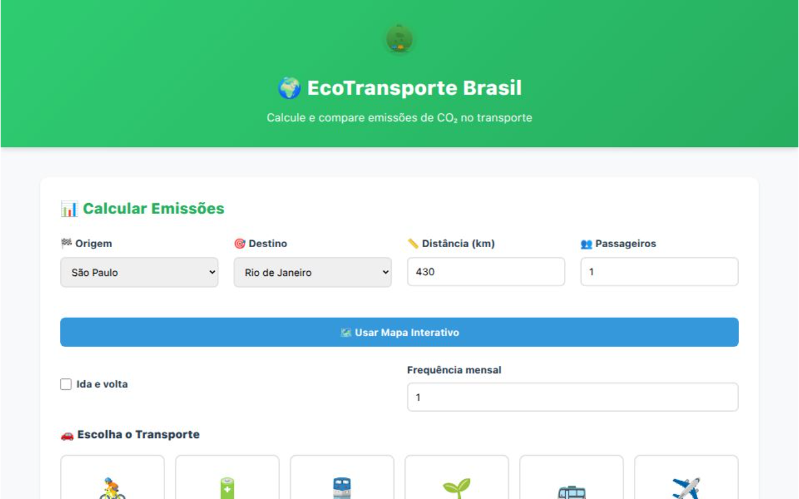

# 🌍 Calculadora EcoTransporte Brasil - Emissões de CO₂

<div align="center">


**Transformando consciência ambiental em ações sustentáveis**

[✨ Demo Online](https://celloweb-ai.github.io/calculadora-co2-transporte-br/) • [🚀 Funcionalidades](#-funcionalidades) • [🛠️ Tecnologias](#%EF%B8%8F-tecnologias-utilizadas) • [📚 Como Usar](#-como-usar)

</div>

---

## 🖼️ Screenshots

<div align="center">

### 💻 Interface Principal



*Tela de cálculo com seleção de origem, destino e modais de transporte*

</div>

---

## 🌟 Visão Geral

A **Calculadora EcoTransporte Brasil** é uma aplicação web interativa que permite calcular e comparar as emissões de CO₂ de diferentes meios de transporte entre as principais cidades brasileiras. Desenvolvida com foco em conscientização ambiental, o projeto utiliza dados científicos atualizados para ajudar usuários a tomarem decisões mais sustentáveis em suas viagens.

### 🎯 Objetivos do Projeto

- **Educação Ambiental**: Conscientizar sobre o impacto das escolhas de transporte
- **Comparação Visual**: Facilitar a comparação entre diferentes modais de transporte
- **Tomada de Decisão**: Empoderar usuários com informações para escolhas mais verdes
- **Acessibilidade**: Interface intuitiva sem necessidade de instalação

## 🚀 Funcionalidades

### 📊 Cálculos Avançados

- **8 Modais de Transporte**: Carro gasolina, carro elétrico, carro híbrido, ônibus, trem, avião, bicicleta e motocicleta
- **Rotas Pré-cadastradas**: Mais de 100 rotas entre 15+ cidades brasileiras
- **Distância Personalizada**: Informe manualmente ou use o mapa interativo
- **Múltiplos Passageiros**: Calcule emissões divididas por número de ocupantes
- **Ida e Volta**: Opção para calcular viagens completas
- **Frequência Mensal**: Projeção de impacto anual

### 🗺️ Sistema de Mapas Integrado

- **Geolocalização**: Marcadores interativos com arrastar-e-soltar
- **Cálculo Automático**: Distância calculada via fórmula de Haversine
- **Visualização de Rota**: Linhas conectadas com feedback visual
- **Integração Leaflet.js**: Mapa responsivo e leve
- **Sincronização Bidirecional**: Seleção no mapa atualiza formulário e vice-versa

### 📊 Visualização de Dados

- **Gráfico Comparativo**: Comparação lado-a-lado de todos os transportes
- **Gráfico de Evolução**: Projeção de emissões por distância (Chart.js)
- **Ranking de Sustentabilidade**: Ordenação automática do menos ao mais poluente
- **Equivalências Ambientais**: Contextualização em árvores, smartphones, energia

### 🤖 Análise Inteligente

- **Feedback Personalizado**: Mensagens baseadas no nível de emissão
- **Recomendações Práticas**: Sugestões de alternativas sustentáveis
- **IA Contextual**: Análise em três níveis (Baixo/Moderado/Alto impacto)
- **Pronto para GPT**: Estrutura preparada para integração com APIs de IA

### 💾 Sistema de Histórico

- **Persistência Local**: Armazenamento via localStorage
- **CRUD Completo**: Criar, ler, atualizar e deletar registros
- **Limite Inteligente**: Mantém os 50 cálculos mais recentes
- **Exportação JSON**: Download de dados para análise externa
- **Recuperação Rápida**: Reutilize cálculos anteriores com um clique

## 🛠️ Tecnologias Utilizadas

| Camada | Tecnologia | Propósito |
|--------|-----------|----------|
| **Frontend** | HTML5 + CSS3 + ES6+ | Estrutura, estilo e lógica |
| **Visualização** | Chart.js v4.4+ | Gráficos interativos e responsivos |
| **Mapas** | Leaflet.js 1.9+ | Sistema de geolocalização e rotas |
| **Armazenamento** | Web Storage API | Persistência local de dados |
| **Design** | CSS Custom Properties | Sistema de design consistente |

### 🎯 Princípios de Desenvolvimento

- **Clean Code**: Código modular, comentado e reutilizável
- **Mobile-First**: Design responsivo desde a concepção
- **Performance**: Carregamento otimizado e execução eficiente
- **Acessibilidade**: ARIA labels e navegação por teclado
- **UX Intuitiva**: Fluxos claros e feedback imediato
- **Zero Dependências**: Funciona diretamente no navegador

## 📚 Estrutura do Projeto

```text
calculadora-co2-transporte-br/
├── index.html                 # Ponto de entrada da aplicação
├── css/
│   └── style.css              # Estilos completos com variáveis CSS
├── js/
│   ├── app.js                 # Inicialização e eventos principais
│   ├── calculator.js          # Lógica de cálculos de emissões
│   ├── charts.js              # Renderização de gráficos (Chart.js)
│   ├── config.js              # Constantes e taxas de CO₂ cientificamente verificadas
│   ├── maps.js                # Integração com Leaflet.js + geolocalização
│   ├── routes-data.js         # 100+ rotas pré-cadastradas entre cidades
│   ├── storage.js             # Gerenciamento de histórico (localStorage)
│   ├── transport-ui.js        # Renderização dinâmica de cards de transporte
│   └── ui.js                  # Manipulação do DOM e interface
├── assets/
│   ├── favicon/               # Ícones da aplicação
│   ├── logo.svg               # Logo EcoTransporte
│   └── screenshots/           # Capturas de tela
├── LICENSE                     # Licença MIT
└── README.md                   # Esta documentação
```

## 📖 Dados de Emissão

### 🔬 Base Científica

Os valores de emissão de CO₂ são baseados em fontes oficiais e dados brasileiros atualizados:

| Transporte | Emissão (g CO₂/km) | Sustentabilidade | Fonte |
|------------|---------------------|------------------|-------|
| 🚴 Bicicleta | **0** | 🌿 Muito Alto | Zero emissões |
| 🔋 Carro Elétrico | **22** | 🌿 Muito Alto | Mix energético BR (hidreletricidade) |
| 🚆 Trem/Metrô | **35** | 🌿 Alto | Transporte elétrico de massa |
| 🌱 Carro Híbrido | **51** | 🌱 Alto | Motor duplo (elétrico + combustão) |
| 🚌 Ônibus | **75** | 🌱 Médio | Transporte coletivo (diesel) |
| ✈️ Avião | **123** | ⚠️ Baixo | Voos domésticos (classe econômica) |
| 🏍️ Motocicleta | **130** | ⚠️ Médio-Baixo | Motos 150-300cc (gasolina) |
| 🚗 Carro Gasolina | **148** | 🛑 Muito Baixo | Veículo 1.0-1.4L (flex/gasolina) |

**Fontes de Dados:**
- 🌐 IPCC (Intergovernmental Panel on Climate Change)
- 🌍 DEFRA (UK Department for Environment, Food & Rural Affairs) 2024
- 🇧🇷 Ministério do Meio Ambiente (Brasil)
- ⚡ EPE - Empresa de Pesquisa Energética (Balanço Energético Nacional)

*⚠️ Valores por passageiro. Para veículos, a emissão é dividida pelo número de passageiros.*

### 🏛️ Cidades Disponíveis

**15 Principais Cidades Brasileiras:**

São Paulo • Rio de Janeiro • Belo Horizonte • Brasília • Curitiba • Porto Alegre • Salvador • Fortaleza • Recife • Manaus • Belém • Goiânia • Campinas • Santos • Florianópolis

**Mais de 100 rotas pré-cadastradas** com distâncias reais entre cidades.

## 🚀 Como Usar

### 🔧 Pré-requisitos

- Navegador moderno (Chrome 90+, Firefox 88+, Safari 14+, Edge 90+)
- Conexão com internet (para CDNs de Chart.js e Leaflet.js)
- JavaScript habilitado

### ⚡ Instalação Local

1. **Clone o repositório**

```bash
git clone https://github.com/celloweb-ai/calculadora-co2-transporte-br.git
cd calculadora-co2-transporte-br
```

2. **Abra no navegador**

```bash
# Opção 1: Abrir diretamente
open index.html  # macOS
start index.html # Windows
xdg-open index.html # Linux

# Opção 2: Servidor local simples (recomendado)
python -m http.server 8000
# Acesse: http://localhost:8000
```

**Nota**: Não há necessidade de instalação de dependências, build ou servidor. O projeto roda diretamente no navegador!

### 🎮 Passo a Passo

1. **Selecione Origem e Destino**: Escolha as cidades nos dropdowns ou clique no mapa
2. **Escolha o Transporte**: Clique no card do modal desejado
3. **Configure Parâmetros**: Ajuste passageiros, frequência, ida/volta
4. **Calcule**: Clique em "Calcular Emissões"
5. **Analise**: Visualize gráficos, ranking e recomendações
6. **Salve**: Armazene no histórico para referência futura

### 💡 Dicas Avançadas

- **Comparação Rápida**: Calcule o mesmo trajeto com diferentes transportes
- **Análise Mensal**: Use a frequência para projetar impacto anual
- **Exportação**: Baixe seu histórico em JSON para planilhas
- **Mapa Interativo**: Arraste os marcadores para ajustar distâncias
- **Clique nas Cidades**: Selecione origem e destino clicando diretamente no mapa

## 🌎 Deploy

### 💚 GitHub Pages (Recomendado)

1. Acesse as **Settings** do repositório
2. Vá em **Pages** no menu lateral
3. Em **Source**, selecione `main` branch
4. Salve e aguarde alguns minutos
5. Seu site estará disponível em: `https://celloweb-ai.github.io/calculadora-co2-transporte-br/`

### 🚀 Outras Opções

- **Netlify**: Arraste a pasta do projeto no [Netlify Drop](https://app.netlify.com/drop)
- **Vercel**: Conecte o repositório GitHub no [Vercel](https://vercel.com/new)
- **Firebase Hosting**: `firebase init` + `firebase deploy`

## 🤝 Contribuindo

Contribuições são muito bem-vindas! Se você tem sugestões, correções ou novas funcionalidades:

### 📝 Processo

1. Faça um **Fork** do projeto
2. Crie uma **Branch** para sua feature (`git checkout -b feature/NovaFuncionalidade`)
3. **Commit** suas mudanças (`git commit -m 'Adiciona nova funcionalidade X'`)
4. **Push** para a Branch (`git push origin feature/NovaFuncionalidade`)
5. Abra um **Pull Request** detalhado

### 🐛 Reportar Bugs

Encontrou um problema? [Abra uma issue](https://github.com/celloweb-ai/calculadora-co2-transporte-br/issues) com:
- Descrição clara do problema
- Passos para reproduzir
- Navegador e versão
- Screenshots (se aplicável)

### ✨ Sugestões de Contribuição

- Adicionar mais cidades e rotas brasileiras
- Implementar modo escuro/claro
- Criar versão PWA (Progressive Web App)
- Integrar com APIs de rotas reais (Google Maps, OpenStreetMap)
- Adicionar suporte multi-idioma
- Implementar compartilhamento em redes sociais

## 🔮 Roadmap Futuro

### 🚀 Próximas Versões

- [ ] **v2.1**: Modo offline completo (PWA)
- [ ] **v2.2**: Integração com APIs de rotas
- [ ] **v2.3**: Dashboard com estatísticas agregadas
- [ ] **v2.4**: Sistema de conquistas e gamificação
- [ ] **v3.0**: Versão multi-idioma (inglês, espanhol)

## 📜 Licença

Este projeto está sob a licença **MIT**. Veja o arquivo [LICENSE](LICENSE) para mais detalhes.

```text
MIT License © 2026 Marcus Vasconcellos

Permissão é concedida, gratuitamente, a qualquer pessoa que obtenha uma cópia
deste software e arquivos de documentação associados, para usar, copiar, modificar,
mesclar, publicar, distribuir, sublicenciar e/ou vender cópias do software.
```

## 👨‍💻 Autor

**Marcus Vasconcellos**

- 🐙 GitHub: [@celloweb-ai](https://github.com/celloweb-ai)
- 💔 LinkedIn: [marcusvasconcellos](https://www.linkedin.com/in/marcusvasconcellos)
- 💼 Empresa: [@Prio3](https://github.com/Prio3)
- 📧 Email: marcus@vasconcellos.net.br
- 📍 Localização: Rio de Janeiro, Brasil

### 🎓 Sobre

Engenheiro Eletrônico e de Computação com MBA, mais de 20 anos de experiência em liderança de automação industrial complexa e cibersegurança. Apaixonado por tecnologia sustentável e soluções que geram impacto positivo.

## 🙏 Agradecimentos

- **DIO (Digital Innovation One)** pelo Laboratório de IA Generativa
- **Comunidade Open Source** por tecnologias fundamentais (Chart.js, Leaflet.js)
- **IPCC, EPA, DEFRA, ANP** pelos dados científicos de emissões
- **Usuários e Contribuidores** por feedback e sugestões

## 📢 Suporte e Contato

Tem dúvidas, sugestões ou quer colaborar?

- 🐛 **Issues**: [GitHub Issues](https://github.com/celloweb-ai/calculadora-co2-transporte-br/issues)
- 💬 **Discussões**: [GitHub Discussions](https://github.com/celloweb-ai/calculadora-co2-transporte-br/discussions)
- 📧 **Email**: marcus@vasconcellos.net.br
- 👤 **LinkedIn**: [Marcus Vasconcellos](https://www.linkedin.com/in/marcusvasconcellos)

---

<div align="center">

### 🌟 Se este projeto foi útil, considere dar uma estrela! ⭐

**🌱 Juntos por um planeta mais sustentável, uma viagem de cada vez.**

[⬆️ Voltar ao Topo](#-calculadora-ecotransporte-brasil---emissões-de-co₂)

</div>
